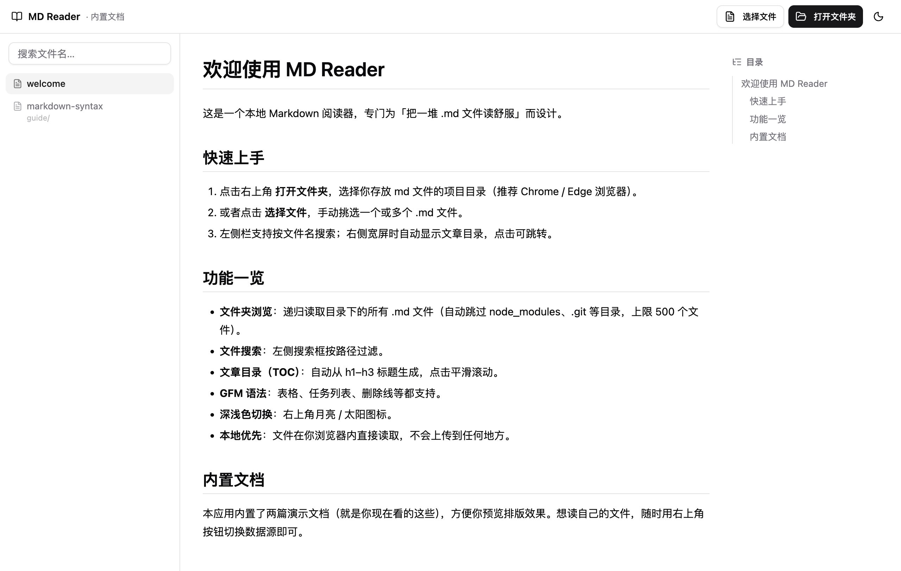

# MD Reader

一个本地优先的 Markdown 阅读器：纯前端渲染，支持读取本地文件夹，也可打包为 macOS 桌面应用（Electron）。



## 功能

- 📂 **打开文件夹**：递归读取目录下所有 `.md` 文件（自动跳过 `node_modules`、`.git` 等，上限 500 个文件），文件只在本地读取，不会上传
- 📄 **选择文件**：手动挑选一个或多个 md 文件（适配不支持文件夹 API 的浏览器）
- 🖱️ **拖拽导入**：把 .md 文件或整个文件夹拖进窗口，自动合并到当前文档列表（同名覆盖）
- 🔍 **文件搜索**：左侧栏按文件名 / 路径过滤
- 📑 **文章目录（TOC）**：自动从 h1–h3 标题生成，点击平滑跳转
- 🧾 **GFM 完整支持**：表格、任务列表、删除线、代码块、引用等
- ∑ **LaTeX 数学公式**：行内 `$...$` 与块级 `$$...$$`，基于 KaTeX 渲染
- 🌗 **深浅色切换**、窄屏抽屉式导航
- ✏️ **阅读 / 编辑切换**：文件夹打开的文档保存时直接写回磁盘文件；内置或手动选择的文档保存在浏览器本地
- 🖥️ **桌面应用**：基于 Electron 打包为原生 macOS App，双击即用

## 技术栈

React 19 · TypeScript · Vite · Tailwind CSS · shadcn/ui · react-markdown (remark-gfm) · Electron

## 开发

```bash
npm install
npm run dev        # 开发服务器（默认 http://localhost:3000）
npm run build      # 生产构建 → dist/
```

## 打包桌面应用（macOS）

```bash
npm run pack       # 构建并打包 → release/mac-arm64/MD Reader.app
```

打包使用 [electron-builder](https://electron.build/)，产物为未签名的 `.app`（本机构建可直接运行；分发给别人需要自行签名公证）。

## 内置文档

应用内置了两篇示例文档（`public/docs/`），打开即可预览排版效果。想读自己的文件，用右上角按钮切换数据源即可。

## 许可

[MIT](LICENSE)
